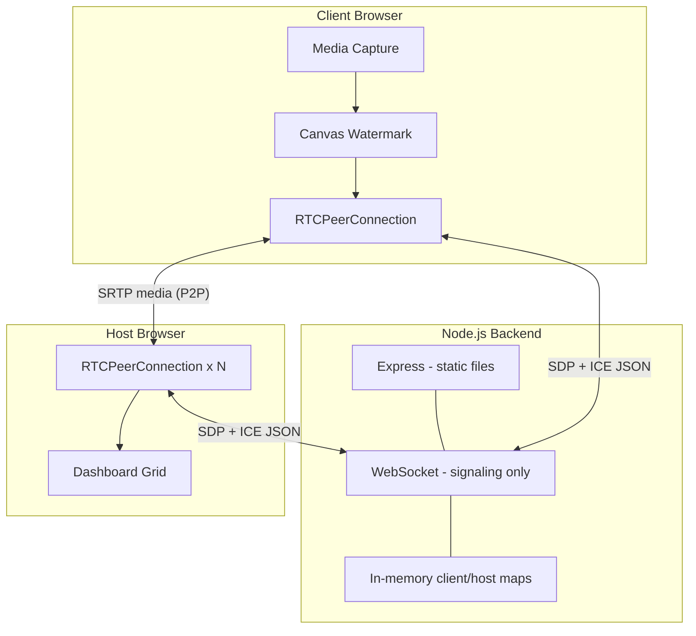

# Architecture Choice — Obraz Streamer

This document explains **why** Obraz Streamer was built with its specific streaming protocols, technology stack, and backend architecture.

---

## 1. Problem Statement

Obraz Streamer must:

- Stream **webcam + screen share** at the same time from one or more broadcasters
- Deliver video to a **host monitoring dashboard** with **sub-second latency**
- Burn a **live timestamp watermark** into every frame before transmission
- Run with **minimal infrastructure** (no dedicated media cluster for v1)

Every architectural choice flows from these requirements.

---

## 2. Streaming Protocol Choice

### Selected: WebRTC (Peer-to-Peer SRTP)

**What we use:**

- Browser **`RTCPeerConnection`** for media transport
- **SDP** (Session Description Protocol) for codec/capability negotiation
- **ICE** (Interactive Connectivity Establishment) for NAT traversal
- **STUN** servers (`stun.l.google.com`) for public address discovery
- **WebSocket** only for signaling (offer, answer, ICE candidates) — not for video bytes

**Why WebRTC and not alternatives?**

| Protocol / approach | Latency | Dual live feeds | Server load | Why not chosen |
|---------------------|---------|-----------------|-------------|----------------|
| **HLS / DASH** | 5–30+ seconds (segment buffering) | Possible but slow | High (packager + CDN) | Unacceptable for live monitoring |
| **WebSocket binary relay** | Low, but server relays every frame | Possible | Very high CPU/bandwidth on Node | Node is not a media server; scales poorly |
| **RTMP → FFmpeg → HLS** | Medium–high | Possible | Heavy ops stack | Too much infra for a focused demo |
| **SFU (mediasoup, Janus, LiveKit)** | Low | Excellent for many viewers | Moderate server cost | Overkill when one host watches N clients via direct P2P |
| **WebRTC P2P** | ~10–150 ms typical | Native multi-track per connection | **Signaling only** on server | **Best fit** for low-latency, browser-native, thin backend |

**Decision:** Use **WebRTC peer-to-peer** because the host dashboard is the primary viewer. Each client opens one `RTCPeerConnection` to the host. Media flows **Client → Host** directly over SRTP after negotiation. The Node server never touches video frames.



---

## 3. Signaling Protocol Choice

### Selected: Custom JSON over WebSocket (`ws` library)

**Message types:**

| Type | Direction | Purpose |
|------|-----------|---------|
| `register` | Client/Host → Server | Join as `role: client` or `role: host` |
| `hosts-available` | Server → Client | List online host IDs |
| `host-joined` | Server → Client | New host came online |
| `client-joined` | Server → Host(s) | New broadcaster registered |
| `client-left` | Server → Host(s) | Broadcaster disconnected |
| `offer` | Client → Host (via server) | WebRTC SDP offer + stream metadata |
| `answer` | Host → Client (via server) | WebRTC SDP answer |
| `candidate` | Both ways (via server) | ICE candidate relay |

**Why WebSocket and not alternatives?**

| Option | Pros | Cons | Verdict |
|--------|------|------|---------|
| **HTTP long-polling** | Simple | High latency, chatty for ICE bursts | Rejected |
| **Socket.io** | Rooms, fallbacks, reconnection helpers | Extra abstraction, larger dependency | Rejected for v1 |
| **Raw WebSocket (`ws`)** | Minimal, full control, same port as HTTP | Manual reconnect logic | **Chosen** |

**Decision:** WebSocket provides a **persistent, bidirectional, low-latency** channel ideal for ICE candidate exchange. The server **relays JSON verbatim** — it does not parse SDP — keeping backend logic simple and protocol-agnostic.

---

## 4. Frontend Technology Choice

### Selected: Vanilla HTML5 + JavaScript (no React/Vue)

| Layer | Technology | Reason |
|-------|------------|--------|
| UI | HTML5 + CSS3 | Direct access to `<video>`, `<canvas>`; no build step |
| Media capture | `getUserMedia`, `getDisplayMedia` | Browser-standard APIs for webcam and screen |
| Watermarking | Canvas 2D + `requestAnimationFrame` | Frame-accurate overlay burned into pixels |
| Stream export | `canvas.captureStream(30)` | Produces a `MediaStream` WebRTC can send |
| Real-time transport | `RTCPeerConnection` | Native WebRTC in all modern browsers |
| Styling | Custom CSS (`style.css`) | Glassmorphic dashboard; shared client/host theme |

**Why not a SPA framework?**

- WebRTC and canvas logic are **imperative** and lifecycle-heavy; a framework adds little value for two static pages.
- Zero bundler means **faster iteration** and easier inspection in DevTools.
- Assignment/demo scope favors **clarity of browser APIs** over component architecture.

---

## 5. Backend Architecture Choice

### Selected: Single-process Node.js monolith (`server.js`)

```
┌─────────────────────────────────────────────────────┐
│                    server.js                         │
│  ┌─────────────┐  ┌──────────────┐  ┌────────────┐ │
│  │   Express   │  │  http.Server │  │ WebSocket  │ │
│  │  (static)   │──│   (shared)   │──│    (ws)    │ │
│  └─────────────┘  └──────────────┘  └────────────┘ │
│                          │                           │
│              ┌───────────┴───────────┐               │
│              │  In-memory Maps       │               │
│              │  clients, hosts       │               │
│              └───────────────────────┘               │
└─────────────────────────────────────────────────────┘
         Port 3000 (configurable via PORT env)
         Bind: 0.0.0.0 (LAN accessible)
```

### Why this backend shape?

| Design decision | Rationale |
|-----------------|-----------|
| **Express for static files only** | Serves `public/` (HTML, JS, CSS). No REST API needed — all real-time logic is WebSocket. |
| **Single HTTP server shared with WebSocket** | Same origin (`localhost:3000`) for pages and `ws://localhost:3000`. Avoids CORS and mixed-port confusion. |
| **No database** | Sessions are ephemeral; reconnect = new registration. Persistence adds no value for live monitoring v1. |
| **In-memory `Map` registries** | O(1) lookup by `clientId` / `hostId` for message routing. Sufficient for single-node demo. |
| **Opaque message relay** | Server forwards `offer` / `answer` / `candidate` as raw JSON strings. No SDP parsing in Node. |
| **Role-based routing** | `register` sets `sessionRole`; relay uses `targetId` to find the correct WebSocket. |
| **Broadcast to all hosts** | `broadcastToHosts()` fan-out for `client-joined` / `client-left` events. |
| **Two dependencies only** | `express` + `ws`. Minimal attack surface, easy deploy, no native addons. |

### What the backend explicitly does NOT do

- Does **not** encode, transcode, or record media
- Does **not** act as TURN/SFU/MCU
- Does **not** authenticate users or enforce rooms
- Does **not** persist session history

This is intentional: the backend is a **signaling coordinator and static file host**, not a media pipeline.

---

## 6. WebRTC Topology Choice

### Selected: Star topology (many clients → one host)

- Each **client** creates one `RTCPeerConnection` per online host (typically one host).
- The **host** maintains one `RTCPeerConnection` per connected client.
- **Client is the offerer** — it initiates SDP only after media (canvas streams) is ready.
- **Host is the answerer** — passive until an offer arrives with stream metadata.

**Why client-initiated offers?**

1. Media capture is async and user-driven (`Initialize Media` → `Go Live`).
2. The host dashboard can stay open idle without needing to know client track state upfront.
3. Matches standard WebRTC patterns for "publisher connects to viewer."

---

## 7. Watermarking Architecture Choice

### Selected: Client-side canvas burn-in (not CSS overlay)

**Pipeline:**

```
Raw webcam/screen → hidden <video> → canvas draw loop → captureStream(30) → WebRTC
                                              ↓
                                    timestamp + REC + label
```

**Why canvas instead of CSS on `<video>`?**

| Approach | Host sees watermark? | Survives recording? | Complexity |
|----------|----------------------|---------------------|------------|
| CSS overlay on client preview | **No** — CSS is not encoded in WebRTC track | No | Low |
| Server-side FFmpeg burn-in | Yes | Yes | Requires media server |
| **Canvas `captureStream`** | **Yes** — pixels are in the video track | Yes | Medium, all client-side |

**Decision:** Canvas burn-in satisfies the requirement that the **remote host** receives stamped frames without any server-side video processing.

---

## 8. Tech Stack Summary

| Layer | Technology | Version / notes |
|-------|------------|-----------------|
| Runtime | Node.js | v16+ (tested on v24) |
| HTTP / static | Express | ^4.19.2 |
| WebSocket | `ws` | ^8.17.0 |
| Frontend | HTML5, CSS3, vanilla JS | No bundler |
| Media | WebRTC, MediaDevices API, Canvas 2D | Browser-native |
| NAT helper | Google public STUN | No TURN in v1 |
| Config | `process.env.PORT` | Default 3000 |

---

## 9. Trade-offs Accepted

| Trade-off | Accepted because |
|-----------|------------------|
| No TURN server | Localhost/LAN demo; documented limitation |
| No auth | Faster build; not production-hardened |
| In-memory state | Server restart clears sessions; OK for prototype |
| P2P bandwidth on host | Host receives N × (webcam + screen) streams; fine for small N |
| 30 FPS canvas cap | Balances CPU vs smooth watermark updates |

---

## 10. Related Documents

- [CHALLENGES_FACED.md](./CHALLENGES_FACED.md) — Technical hurdles encountered during implementation
- [SOLUTIONS.md](./SOLUTIONS.md) — Engineering solutions applied to each challenge
- [METHODOLOGY.md](./METHODOLOGY.md) — Full engineering process and phases
- [README.md](./README.md) — Setup and usage guide
