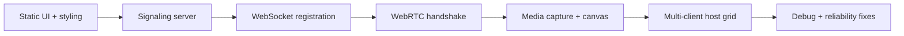

# Methodology & Challenges — Obraz Streamer

This document describes the engineering process used to design, build, and stabilize **Obraz Streamer**: a real-time dual-feed (webcam + screen) broadcasting system with a centralized host monitoring dashboard.

---

## 1. Project Goals & Constraints

### Objectives

| Goal | Rationale |
|------|-----------|
| **Low-latency live video** | Monitoring use case requires near real-time feedback, not buffered uploads |
| **Dual simultaneous feeds** | Operators need both face (webcam) and context (screen) per broadcaster |
| **Visible timestamp watermark** | Prove when frames were captured; support audit/review workflows |
| **Multi-client host view** | One dashboard can watch many broadcasters at once |
| **Minimal backend** | Avoid media servers, databases, and heavy ops for a prototype/demo stack |

### Constraints

- **Browser-only capture** — `getUserMedia` and `getDisplayMedia`; no native desktop agents
- **No dedicated media infrastructure** — budget and complexity favor peer-to-peer WebRTC over SFU/MCU
- **Single Node process** — one `server.js` for static assets and signaling
- **Local/LAN-first** — `localhost` and `0.0.0.0` binding; production hardening deferred

---

## 2. Engineering Methodology

Development followed an **incremental, layer-by-layer** approach: prove each layer before stacking the next.



### Phase 1 — Foundation & static delivery

- Scaffolded **Express** to serve `public/` (client page, host page, CSS, JS).
- Defined visual language in `style.css` (glassmorphic panels, badges, responsive grid).
- Separated concerns: `index.html` + `client.js` vs `host.html` + `host.js`.

**Outcome:** Pages load from one origin; no CORS issues for WebSocket on the same host/port.

### Phase 2 — Signaling server

- Attached **WebSocket** (`ws`) to the same HTTP server as Express.
- Implemented in-memory registries: `clients` and `hosts` as `Map` structures keyed by browser-generated IDs.
- Defined a small JSON protocol: `register`, `offer`, `answer`, `candidate`, plus presence events (`client-joined`, `host-joined`, `hosts-available`, `client-left`, `welcome-host`).

**Outcome:** Host and client can register and exchange opaque signaling messages without the server parsing SDP.

### Phase 3 — WebRTC peer connection

- Client acts as **offerer**; host as **answerer** (standard one-to-many pattern when multiple clients connect to one host).
- Configured **STUN** (`stun.l.google.com`) for NAT discovery; no TURN in scope for v1.
- Implemented **ICE candidate queuing** on both sides when remote description is not yet set — avoids race conditions during handshake.

**Outcome:** Signaling completes; media path is browser-to-browser after negotiation.

### Phase 4 — Media pipeline (client)

1. Acquire **webcam** (`getUserMedia`) with audio fallback to video-only if mic fails.
2. Acquire **screen** (`getDisplayMedia`).
3. Draw each feed to a **canvas** via `requestAnimationFrame`.
4. Overlay watermark: pulsing REC dot, `HH:MM:SS` clock, `WEBCAM` / `SCREEN` labels.
5. Export with `canvas.captureStream(30)`; re-attach webcam audio track to the canvas stream.
6. Add all tracks to `RTCPeerConnection` and send offer with **stream/track metadata** for host-side routing.

**Outcome:** Host receives watermarked video plus optional audio; raw device pixels are not sent unmodified.

### Phase 5 — Host dashboard & multi-client UX

- Dynamic **client cards** injected into `#clients-grid` per `clientId`.
- Separate `<video>` elements per client for webcam and screen, backed by `MediaStream` objects built in `ontrack`.
- Empty state when no clients; auto-reconnect signaling on WebSocket close (host only).
- XSS-safe display names via `escapeHtml`.

**Outcome:** Scalable grid UI; multiple tabs can broadcast concurrently.

### Phase 6 — Integration testing & stabilization

- Added `test_ws.js` for quick signaling connectivity checks.
- Diagnosed **client/host not connecting** issues: signaling OK, media mapping fragile.
- **Fix:** Route tracks by **`MediaStream.id`** in the offer payload (more stable across peers than `track.id`), with track-ID and kind-based fallbacks on the host.

**Outcome:** More reliable mapping of webcam vs screen (and audio) on the host dashboard.

---

## 3. Architecture Decisions

| Decision | Alternatives considered | Why we chose this |
|----------|-------------------------|-------------------|
| **WebRTC P2P** | HLS/WebSocket video relay, mediasoup/Janus SFU | Lowest latency; no server-side transcoding; fits 2-party-per-client topology |
| **WebSocket signaling** | Socket.io, HTTP long-poll | Minimal dependency (`ws`); full control over message schema |
| **Canvas watermark** | CSS overlay on `<video>`, server-side burn-in | Watermark is encoded into the sent pixels; host sees stamped frames even if UI CSS differs |
| **Client-initiated offer** | Host-initiated | Client owns media readiness; host is passive listener until offer arrives |
| **In-memory session maps** | Redis, DB sessions | Simplicity for demo/single-node; acceptable for non-persistent prototype |
| **No authentication** | JWT, room passwords | Faster iteration; documented as limitation |

---

## 4. Technical Flow (End-to-End)

1. **Host** opens `host.html` → WebSocket → `register` (`role: host`).
2. **Client** captures media → clicks **Go Live** → WebSocket → `register` (`role: client`).
3. Server sends **`hosts-available`** to client (or **`host-joined`** to existing clients when host connects later).
4. Client creates **`RTCPeerConnection`**, adds canvas streams, **`createOffer`** → server relays **`offer`** to host (includes `webcamStreamId`, `screenStreamId`, track IDs, display name).
5. Host **`setRemoteDescription`**, **`createAnswer`** → server relays **`answer`** to client.
6. Both sides exchange **`candidate`** messages until ICE connects.
7. Host **`ontrack`** maps streams to UI videos; client shows **Streaming** badge.

Media never passes through Node.js — only SDP and ICE JSON do.

---

## 5. Challenges & Resolutions

### 5.1 WebRTC handshake timing (ICE before remote description)

**Problem:** ICE candidates sometimes arrived before `setRemoteDescription` completed, causing `addIceCandidate` failures or dropped candidates.

**Approach:** Queue candidates on `RTCPeerConnection` (or per-client object on host) until remote description is set; flush queue after answer/offer handling.

**Lesson:** Signaling order is non-deterministic over WebSocket; always design for out-of-order ICE.

---

### 5.2 Track identification across peers

**Problem:** Host mapped incoming tracks using **`track.id`** from the client’s offer. Track IDs are **not guaranteed to match** on the remote peer’s `ontrack` event, leading to blank feeds or wrong feed on wrong video element.

**Approach:**

- Client sends **`webcamStreamId`** and **`screenStreamId`** (from `MediaStream.id`) in the offer.
- Host prefers **`event.streams[0].id`** matching those IDs.
- Fallback: legacy track IDs, then heuristic (first video → webcam, second → screen; audio → webcam stream).

**Lesson:** Prefer **stream-level** identifiers for multi-track WebRTC apps; treat track IDs as hints only.

---

### 5.3 Dual capture permission UX

**Problem:** Users must grant camera *and* pick a screen share; either denial blocks “Go Live.”

**Approach:** Webcam audio failure falls back to video-only; clear UI states (`Inactive` / `Active` stats); screen track `ended` listener stops stream and resets UI if user stops share from the browser chrome.

**Lesson:** Degrade gracefully per track; don’t fail entire session on optional audio.

---

### 5.4 Canvas performance vs quality

**Problem:** Full-resolution canvas draw every frame can stress CPU on weak laptops.

**Approach:** Target 30 FPS via `captureStream(30)`; ideal constraints on `getUserMedia` / `getDisplayMedia` (640×480 webcam, 720p screen); single `requestAnimationFrame` loop per canvas.

**Trade-off:** Watermark is burned in — cannot toggle overlay on host without client change.

---

### 5.5 Port already in use (`EADDRINUSE`)

**Problem:** Development restarts left orphan `node server.js` processes holding port 3000.

**Approach:** Document `netstat` / `taskkill` (Windows) or `Get-NetTCPConnection` cleanup; verify with `test_ws.js` after restart.

**Lesson:** Treat signaling health as a prerequisite before debugging WebRTC in the browser.

---

### 5.6 Host–client connection order

**Problem:** If client goes live before host registers, behavior depends on presence messages (`hosts-available` vs `host-joined`).

**Approach:** Server notifies clients when a host joins and notifies host of existing clients; client retries connection on `host-joined`. Recommended UX: **open host dashboard first**, then client.

---

### 5.7 NAT and firewall limitations

**Problem:** P2P may fail on strict corporate networks without **TURN**.

**Approach:** STUN only in v1; document as known limitation. Production would add a TURN service (e.g. coturn) and `iceServers` credentials.

---

## 6. Testing Strategy

| Layer | Method | Tool / signal |
|-------|--------|----------------|
| Signaling server up | Automated | `node test_ws.js` → WebSocket open on port 3000 |
| Static assets | Manual | Load `/` and `/host.html` |
| Registration | Manual + console | Server logs `Host registered` / `Client registered` |
| WebRTC | Manual | Browser devtools: connection state, ICE, `ontrack` logs |
| Media | Manual | Host grid shows both feeds; resolution badges update |
| Errors | Built-in | `showVisualError` overlay + `window.onerror` / unhandled rejection handlers |

No automated E2E WebRTC tests in CI (browser permissions and real devices make this costly); manual two-tab workflow is the primary integration test.

---

## 7. Code Organization

```
obraz/
├── server.js           # Express + WebSocket signaling
├── test_ws.js          # Signaling smoke test
├── package.json
├── README.md           # User-facing setup & usage
├── METHODOLOGY.md      # This document
└── public/
    ├── index.html      # Client broadcaster UI
    ├── host.html       # Host dashboard UI
    ├── css/style.css   # Shared premium styling
    └── js/
        ├── client.js   # Capture, canvas, offer, ICE
        └── host.js     # Answer, ontrack, dynamic grid
```

---

## 8. Known Limitations & Future Work

| Limitation | Possible next step |
|------------|-------------------|
| No TURN server | Deploy coturn; add credentials to `RTC_CONFIG` |
| No auth / rooms | Room IDs, tokens, host PIN |
| In-memory state | Redis for multi-instance signaling |
| Server doesn’t record | Optional MediaRecorder on host or SFU archive |
| Single port dev friction | `PORT` env + process manager (pm2) docs |
| HTTPS required on non-localhost | TLS reverse proxy for secure `getUserMedia` on remote devices |

---

## 9. Summary

Obraz Streamer was built by **separating concerns**: a thin Node signaling layer, fat browser logic for capture and WebRTC, and a host UI that assembles many peer connections dynamically. The hardest problems were not HTTP or WebSocket wiring but **WebRTC lifecycle ordering** and **cross-peer track identity**. Addressing those with ICE queuing and stream-ID metadata made the system reliable enough for multi-tab demo and LAN monitoring scenarios.

For operational details, see [README.md](./README.md). For backend message types and relay behavior, see `server.js` and the signaling sections in `public/js/client.js` and `public/js/host.js`.
